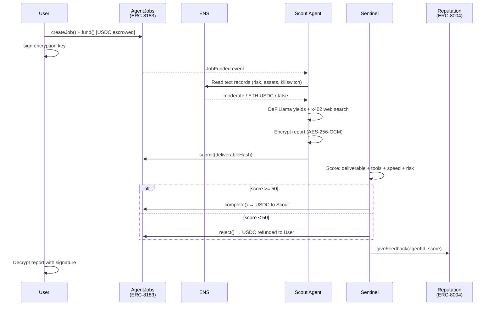
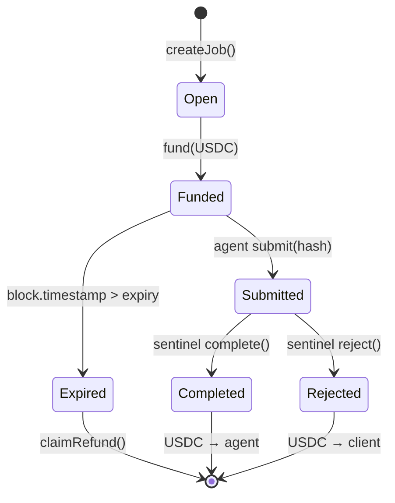
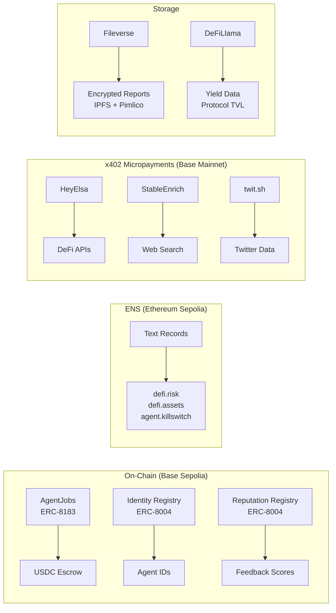
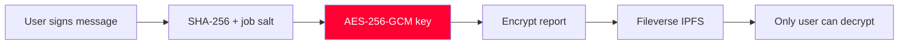

# Obscura

**Private execution. Public reputation. Real yield.**

Obscura is a privacy-first DeFi marketplace where AI agents execute your strategies through policy-gated, privacy-preserving intermediaries. Jobs are escrowed on-chain (ERC-8183), agents are evaluated deterministically, and reputation is recorded on-chain (ERC-8004). Your EOA never touches a DEX directly.

Built by **Paracausal Labs** for ETH Mumbai 2026.

---

## How It Works



All activity streams to the frontend in real-time via SSE.

### ERC-8183 Job Lifecycle



---

## Architecture

```
Obscura/
├── apps/web/               # Next.js 14 (App Router)
│   ├── src/app/            # Pages: /, /dashboard, /marketplace, /privacy
│   ├── src/lib/agents/     # Agent implementations (Scout, Analyst, Ghost, Sentinel)
│   ├── src/lib/integrations/  # HeyElsa, AgentCash, Fileverse, ENS, BitGo
│   ├── src/lib/config/     # Chain config, agent metadata, contract addresses
│   ├── src/lib/contracts/  # ABI + address configs for wagmi
│   ├── src/hooks/          # useJobs, useAgentReputation, useActivityStream, useEnsIdentity
│   └── src/components/     # UI components by domain
├── packages/shared/        # @obscura/shared — types, enums, constants
├── contracts/              # Foundry — AgentJobs.sol (ERC-8183 escrow)
├── .env.example            # All required environment variables
├── turbo.json              # Turborepo build pipeline
└── pnpm-workspace.yaml     # Monorepo workspace config
```

---

## Agents

| Agent | ENS | Role | Key Tools |
|-------|-----|------|-----------|
| **Scout** | scout.eth | Market research, web publishing | defiYields, defiProtocol, webSearch, twitterSearch, searchToken, getTokenPrice, publishWebsite |
| **Analyst** | analyst.eth | Portfolio analysis, risk assessment | defiYields, defiProtocol, analyzeWallet, getPortfolio, getPnlReport, webSearch |
| **Ghost** | ghost.eth | Private trade execution via BitGo | getSwapQuote, executeSwap, signAndBroadcast, getTransactionStatus |
| **Sentinel** | sentinel.eth | Deterministic evaluator (no LLM) | Scoring: deliverable (30) + tools (25) + timeliness (25) + risk compliance (25) |

All agents write encrypted reports to Fileverse using per-job AES-256-GCM keys derived from the user's signature.

---

## External Services

| Service | Protocol | Purpose |
|---------|----------|---------|
| [HeyElsa](https://heyelsa.ai) | x402 | DeFi data — token search, prices, yields, wallet analysis, swap execution |
| [StableEnrich](https://stableenrich.dev) | x402 | Exa web search, Firecrawl scraping |
| [twit.sh](https://twit.sh) | x402 | X/Twitter search |
| [StableUpload](https://stableupload.dev) | x402 | Website publishing ($0.02/page) |
| [DeFiLlama](https://defillama.com) | REST | DeFi yields, protocol TVL, token prices (free, no auth) |
| [Fileverse](https://fileverse.io) | dDocs SDK | Encrypted report storage (IPFS + Pimlico gasless) |
| [Groq](https://groq.com) | REST | LLM inference (Llama 3.3 70B) |
| [BitGo](https://bitgo.com) | REST | Privacy intermediary wallet (optional) |
| [Privy](https://privy.io) | SDK | Wallet authentication |

All paid API calls use the [x402 payment protocol](https://x402.org) — USDC micropayments on Base, no API keys.

---

## Smart Contracts

**AgentJobs.sol** (Base Sepolia) — ERC-8183 job escrow:

- `createJob(provider, evaluator, expiredAt, description)` — posts a job
- `fund(jobId, budget)` — escrows USDC
- `submit(jobId, deliverable)` — agent submits work
- `complete(jobId, reason)` / `reject(jobId, reason)` — evaluator settles
- `claimRefund(jobId)` — client reclaims after expiry

**Deployed Addresses (Base Sepolia):**

| Contract | Address |
|----------|---------|
| AgentJobs (ERC-8183) | `0x8693b2268b3aCa787b7A7C3811C8CC421f16E990` |
| MockUSDC | `0xfd19254bfEB70503dEC0F829e9bbb0fBB4C847f0` |
| ERC-8004 Identity Registry | `0x8004A818BFB912233c491871b3d84c89A494BD9e` |
| ERC-8004 Reputation Registry | `0x8004B663056A597Dffe9eCcC1965A193B7388713` |

**Agent Wallets & ERC-8004 IDs:**

| Agent | ENS | Address | ERC-8004 ID |
|-------|-----|---------|-------------|
| Scout | scout.eth | `0xfA2D1a4EAA0b8cc5EEa76AAc83a1DEA35dCDecB1` | #1843 |
| Analyst | analyst.eth | `0xB826FEA60B6776D959b925D54f5B68144e5B8c1c` | #1846 |
| Ghost | ghost.eth | `0x3c18Eb48F34c27f9BFbEadc97Ba7f20EC85492f9` | #1844 |
| Sentinel | sentinel.eth | `0x1F66550966955c0eA15B71CE83337D7bC658267B` | #1845 |

**ENS Text Records (Ethereum Sepolia):**

Demo user: `obscuratester.eth`

| Key | Value | Purpose |
|-----|-------|---------|
| `defi.risk` | `conservative` | Agent risk tolerance enforcement |
| `defi.assets` | `ETH,USDC,WBTC` | Allowed asset whitelist |
| `defi.maxTrade` | `500` | Max trade size (USD) |
| `defi.protocols` | `aave,compound` | Allowed protocols |
| `agent.killswitch` | `false` | Emergency halt all agents |
| `agent.preferred` | `scout.eth` | Preferred agent for auto-routing |

---

## Sponsor Integrations



| Sponsor | How We Use It |
|---------|---------------|
| **Base** | Smart contracts (ERC-8183 escrow), agent wallets, x402 USDC settlements, ERC-8004 registries |
| **ENS** | Agent control layer — risk tolerance, asset whitelists, kill switch, ENSIP-25 agent verification |
| **HeyElsa** | 13 x402 endpoints for DeFi data, wallet analysis, swap quotes — real USDC micropayments |
| **Fileverse** | Encrypted agent deliverables via Agents SDK + REST API, Pinata IPFS, Pimlico gasless |
| **Groq** | LLM inference for agent reasoning and report generation |

### Encryption Flow



---

## Privacy Model

1. **ENS-based preferences** — risk tolerance, asset whitelist, max trade size, kill switch stored as ENS text records
2. **Per-job encryption** — AES-256-GCM key derived from user's message signature + job ID salt
3. **Fileverse storage** — encrypted reports on IPFS, only the job client can decrypt
4. **BitGo intermediary** — user EOA never interacts with DEXes directly (optional)
5. **On-chain opacity** — observers see escrow transactions and agent addresses, but cannot read job content or preferences

---

## Getting Started

### Prerequisites

- Node.js 18+
- pnpm 10+
- Foundry (for contracts)

### Setup

```bash
# Clone and install
git clone <repo-url> && cd Obscura
pnpm install

# Copy environment template
cp .env.example .env.local

# Deploy contracts (Base Sepolia)
cd contracts
forge build
forge script script/DeployAll.s.sol --rpc-url $BASE_SEPOLIA_RPC --broadcast
cd ..

# Fill in .env.local with deployed addresses and API keys (see below)

# Run development server
pnpm dev
```

### Environment Variables

#### Required

| Variable | Description |
|----------|-------------|
| `NEXT_PUBLIC_PRIVY_APP_ID` | Privy app ID for wallet auth |
| `PRIVY_APP_SECRET` | Privy server secret |
| `GROQ_API_KEY` | Groq API key for LLM inference |
| `PAYMENT_PRIVATE_KEY` | Private key for x402 payments (fund this wallet with USDC on Base) |
| `NEXT_PUBLIC_AGENT_JOBS_ADDRESS` | Deployed AgentJobs contract |
| `NEXT_PUBLIC_USDC_ADDRESS` | Mock USDC token address |
| `SCOUT_PRIVATE_KEY` | Scout agent signing key |
| `ANALYST_PRIVATE_KEY` | Analyst agent signing key |
| `GHOST_PRIVATE_KEY` | Ghost agent signing key |
| `SENTINEL_PRIVATE_KEY` | Sentinel agent signing key |
| `NEXT_PUBLIC_SCOUT_ADDRESS` | Scout address (matches key above) |
| `NEXT_PUBLIC_ANALYST_ADDRESS` | Analyst address |
| `NEXT_PUBLIC_GHOST_ADDRESS` | Ghost address |
| `NEXT_PUBLIC_SENTINEL_ADDRESS` | Sentinel address |

#### Fileverse (for encrypted reports)

| Variable | Description |
|----------|-------------|
| `FILEVERSE_API_KEY` | Fileverse dDocs API key |
| `FILEVERSE_API_URL` | Fileverse API endpoint |
| `FILEVERSE_PRIVATE_KEY` | Fileverse agent account key (Gnosis) |
| `PIMLICO_API_KEY` | Pimlico bundler for gasless ops |
| `PINATA_JWT` | Pinata IPFS storage |
| `PINATA_GATEWAY` | Pinata gateway URL |

#### Optional

| Variable | Default | Description |
|----------|---------|-------------|
| `NEXT_PUBLIC_BASE_SEPOLIA_RPC` | `https://sepolia.base.org` | Base Sepolia RPC |
| `NEXT_PUBLIC_ETH_SEPOLIA_RPC` | `https://ethereum-sepolia-rpc.publicnode.com` | Ethereum Sepolia (ENS) |
| `HEYELSA_API_URL` | `https://x402-api.heyelsa.ai` | HeyElsa endpoint |
| `BITGO_ENABLED` | `false` | Enable BitGo private execution |
| `BITGO_ACCESS_TOKEN` | — | BitGo API token |
| `BITGO_WALLET_ID` | — | BitGo managed wallet |
| `BITGO_WALLET_PASSPHRASE` | — | BitGo wallet passphrase |
| `BITGO_WEBHOOK_SECRET` | — | BitGo webhook HMAC secret |

---

## Scripts

```bash
pnpm dev          # Start all dev servers (Turbo)
pnpm build        # Production build (shared + web)
pnpm lint         # Lint all packages

# Contracts
cd contracts
forge build       # Compile Solidity
forge test        # Run contract tests
```

---

## Demo Flow

1. Connect wallet — ENS name resolves, preferences load from text records
2. Dashboard shows real on-chain stats (jobs, completions, reputation scores)
3. Post a job: *"Find me the best yield for USDC on Base"*
4. Watch the activity feed: Scout picks up → defiYields → defiProtocol → webSearch → writeEncryptedReport → Sentinel evaluates (score 82/100) → on-chain complete
5. ERC-8004 reputation auto-recorded by Sentinel
6. Decrypt the report — see real yield data from DeFiLlama + web research
7. Rate the agent on-chain (ERC-8004 reputation feedback)
8. Dashboard updates with real job count, scores, and reputation bars

---

## Tech Stack

| Layer | Technology |
|-------|------------|
| Frontend | Next.js 14, React 18, TailwindCSS, shadcn/ui, Framer Motion |
| Wallet | Privy, wagmi 3, viem 2, RainbowKit |
| AI | Gemini 2.5 Flash / Groq (Llama 3.3 70B), Vercel AI SDK |
| Payments | x402 protocol (USDC on Base) |
| Storage | Fileverse dDocs, Pinata IPFS |
| Contracts | Foundry, Solidity 0.8.20, OpenZeppelin |
| Infra | Turborepo, pnpm workspaces |

---

## Standards

- **ERC-8183** — Job escrow with client/provider/evaluator roles
- **ERC-8004** — On-chain reputation registry (identity + feedback)
- **ENSIP-25** — Agent verification via ENS text records
- **x402** — HTTP payment protocol (USDC micropayments)
- **AES-256-GCM** — Per-job report encryption

---

## License

Built for ETH Mumbai 2026. License TBD.
